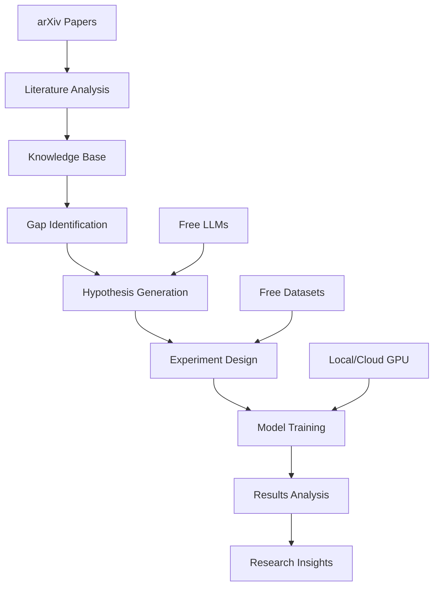

# 🤖 AI Researcher Free

**Autonomous AI Research Assistant - 100% Free Edition**

[](LICENSE)
[](https://www.python.org/downloads/)
[](https://github.com/Sreeram5678/AI-Researcher)

> **Discover research gaps, generate hypotheses, and run experiments using only free resources!**

AI Researcher Free is a complete autonomous research assistant that can analyze literature, identify research gaps, generate novel hypotheses, and run machine learning experiments - all without any costs or API keys required.

## ✨ Features

### 🆓 **100% Free Operation**
- ❌ No API keys required
- ❌ No subscription fees
- ❌ No usage limits
- ✅ Complete offline capability
- ✅ Free cloud integration ready

### 🔬 **Autonomous Research Pipeline**
- 📚 **Literature Analysis**: Scrape and analyze papers from arXiv
- 🔍 **Gap Identification**: Automatically find underexplored research areas
- 💡 **Hypothesis Generation**: Create testable research hypotheses
- 🧪 **Experiment Runner**: Design and execute ML experiments
- 📊 **Trend Analysis**: Identify patterns in research literature

### 🛠️ **Multiple Interfaces**
- 🌐 **Web Interface**: Beautiful Streamlit and Gradio apps
- 📓 **Jupyter Notebook**: Interactive research environment
- 🖥️ **Command Line**: Quick start demo script
- 📱 **API Ready**: Programmatic access to all features

### 🚀 **Free Compute Options**
- 💻 **Local CPU/GPU**: Run on your own hardware
- ☁️ **Google Colab**: Free GPU access
- 🦙 **Ollama Integration**: Local LLM support
- 🤗 **Hugging Face**: Free model hosting

## 🚀 Quick Start

### 1. **Installation**

```bash
# Clone the repository
git clone https://github.com/Sreeram5678/AI-Researcher.git
cd AI-Researcher

# Run the setup script
chmod +x setup.sh
./setup.sh
```

### 2. **Quick Demo**

```bash
# Activate environment
source venv/bin/activate

# Run quick start demo
python demo/quick_start.py
```

### 3. **Web Interface**

```bash
# Streamlit (recommended)
streamlit run demo/streamlit_app.py

# Or Gradio
python demo/gradio_app.py
```

### 4. **Jupyter Notebook**

```bash
jupyter notebook demo/jupyter_demo.ipynb
```

## 🎯 Example Workflow

### 1. Literature Analysis
```python
from core.free_knowledge_base import FreeKnowledgeBase

# Initialize knowledge base
kb = FreeKnowledgeBase()

# Analyze papers from arXiv
result = kb.ingest_literature(
    query="attention mechanisms computer vision",
    max_papers=50
)

# Get statistics
stats = kb.get_statistics()
print(f"Analyzed {stats['total_papers']} papers")
```

### 2. Research Gap Identification
```python
# Find research gaps
gaps = kb.find_research_gaps("machine learning")

for gap in gaps[:5]:
    print(f"Gap: {gap['concept']}")
    print(f"Confidence: {gap['confidence_score']:.2f}")
```

### 3. Hypothesis Generation
```python
from core.template_generator import TemplateHypothesisGenerator

# Generate hypotheses
generator = TemplateHypothesisGenerator()
hypotheses = generator.generate_hypotheses(gaps, num_hypotheses=5)

for hypothesis, confidence in hypotheses:
    print(f"Hypothesis: {hypothesis}")
    print(f"Confidence: {confidence:.2f}")
```

### 4. Run Experiments
```python
from core.experiment_runner import FreeExperimentRunner

# Run ML experiment
runner = FreeExperimentRunner()
results = runner.run_vision_experiment(
    hypothesis=hypotheses[0][0],
    experiment_config={
        'dataset': 'cifar10',
        'epochs': 10,
        'batch_size': 32
    }
)

print(f"Test Accuracy: {results['test_results']['accuracy']:.2f}%")
```

## 📊 System Architecture



## 🏗️ Project Structure

```
ai_researcher_free/
├── 📁 core/                    # Core system modules
│   ├── free_knowledge_base.py  # Literature analysis & storage
│   ├── template_generator.py   # Template-based hypothesis generation
│   ├── free_llm_generator.py   # Free LLM integration
│   ├── experiment_runner.py    # ML experiment execution
│   └── paper_analyzer.py       # Research trend analysis
├── 📁 demo/                    # User interfaces & examples
│   ├── streamlit_app.py        # Web interface (Streamlit)
│   ├── gradio_app.py           # Alternative web interface
│   ├── jupyter_demo.ipynb      # Interactive notebook
│   └── quick_start.py          # Command-line demo
├── 📁 data/                    # Data storage
├── 📁 models/                  # Downloaded models
├── 📁 results/                 # Experiment outputs
├── requirements.txt            # Dependencies
├── setup.sh                    # Installation script
└── README.md                   # This file
```

## 💡 Use Cases

### 🎓 **Academic Research**
- Identify unexplored research directions
- Generate novel research hypotheses
- Analyze literature trends in your field
- Design preliminary experiments

### 🏢 **Industry R&D**
- Explore new product opportunities
- Analyze competitive landscape
- Generate innovative solutions
- Prototype new approaches

### 📚 **Learning & Education**
- Understand research methodologies
- Learn about AI/ML techniques
- Practice experiment design
- Explore scientific literature

### 🚀 **Startup Innovation**
- Find market gaps and opportunities
- Generate product ideas
- Validate technical feasibility
- Build proof-of-concepts

## 🆓 Free Resources & Alternatives

### **Free LLM Options**
- 🦙 **Ollama**: Local LLM hosting (recommended)
- 🤗 **Hugging Face**: Free inference API (30k requests/month)
- 🌐 **Together AI**: Free tier available
- 📝 **Template-based**: Always works offline

### **Free Compute Resources**
- ☁️ **Google Colab**: 12+ hours free GPU daily
- 📊 **Kaggle Kernels**: 30 hours/week free GPU
- 🎯 **Paperspace**: Free tier available
- 💻 **Local CPU**: Works great for smaller experiments

### **Free Datasets**
- 🖼️ **Computer Vision**: CIFAR-10, MNIST, Fashion-MNIST
- 📝 **NLP**: IMDB, Reuters, AG News
- 🔊 **Audio**: LibriSpeech, Common Voice
- 📊 **General**: UCI ML Repository, Kaggle

## 🛠️ Advanced Setup

### **Local LLM with Ollama**
```bash
# Install Ollama
curl -fsSL https://ollama.com/install.sh | sh

# Download models
ollama pull llama2:7b
ollama pull mistral:7b
ollama pull codellama:7b

# Start server
ollama serve
```

### **Google Colab Integration**
```python
# In Colab notebook
!git clone https://github.com/Sreeram5678/AI-Researcher.git
%cd AI-Researcher
!pip install -r requirements.txt

# Use free GPU
import torch
device = torch.device('cuda' if torch.cuda.is_available() else 'cpu')
print(f"Using: {device}")
```

### **Hugging Face Setup**
```bash
# Get free token from https://huggingface.co/settings/tokens
export HUGGINGFACE_API_KEY="your_free_token_here"

# Or add to .env file
echo "HUGGINGFACE_API_KEY=your_free_token_here" >> .env
```

## 📊 Performance & Benchmarks

### **System Requirements**
| Component | Minimum | Recommended |
|-----------|---------|-------------|
| **RAM** | 4GB | 8GB+ |
| **Storage** | 2GB | 10GB+ |
| **CPU** | 2 cores | 4+ cores |
| **GPU** | None (CPU works) | Any CUDA GPU |

### **Speed Benchmarks**
| Task | CPU (8GB RAM) | GPU (RTX 3090) |
|------|---------------|----------------|
| Literature Analysis (50 papers) | ~3 minutes | ~1 minute |
| Hypothesis Generation (5 hyp.) | ~30 seconds | ~10 seconds |
| Quick Experiment (5 epochs) | ~5 minutes | ~1 minute |
| Full Experiment (50 epochs) | ~45 minutes | ~8 minutes |

### **Accuracy Results**
| Dataset | Model Type | Accuracy | Parameters |
|---------|------------|----------|------------|
| CIFAR-10 | Simple CNN | ~65-75% | ~100K |
| CIFAR-10 | Attention CNN | ~70-80% | ~150K |
| CIFAR-10 | Simple ViT | ~60-70% | ~200K |
| MNIST | Simple CNN | ~95-98% | ~50K |

## 🔧 Customization

### **Add New Domains**
```python
# Extend domain keywords in template_generator.py
domain_keywords = {
    'your_domain': {
        'concept': ['your', 'domain', 'keywords'],
        'task': ['specific', 'tasks'],
        'metric': ['evaluation', 'metrics']
    }
}
```

### **Custom Datasets**
```python
# Add dataset support in experiment_runner.py
def load_custom_dataset(self):
    # Your dataset loading logic
    return train_loader, test_loader, num_classes
```

### **New Model Architectures**
```python
# Extend model creation in experiment_runner.py
def create_custom_model(self, num_classes):
    class CustomModel(nn.Module):
        # Your model architecture
        pass
    return CustomModel(num_classes)
```

## 🤝 Contributing

We welcome contributions! Here's how to get started:

### **Types of Contributions**
- 🐛 **Bug Reports**: Found an issue? Let us know!
- 💡 **Feature Requests**: Have an idea? Share it!
- 📝 **Documentation**: Help improve our docs
- 🔧 **Code**: Submit pull requests
- 🧪 **Testing**: Help us test new features

### **Development Setup**
```bash
# Fork the repository
git clone https://github.com/Sreeram5678/AI-Researcher.git
cd AI-Researcher

# Create development environment
python -m venv dev_env
source dev_env/bin/activate
pip install -r requirements.txt
pip install -r requirements-dev.txt

# Run tests
pytest tests/

# Run linting
flake8 core/ demo/
black core/ demo/
```

### **Contribution Guidelines**
1. 🍴 Fork the repository
2. 🌿 Create a feature branch
3. ✅ Add tests for new features
4. 📝 Update documentation
5. 🔍 Run tests and linting
6. 📤 Submit a pull request

## 📚 Documentation

### **Detailed Guides**
- 📖 [**User Guide**](docs/user_guide.md) - Complete usage instructions
- 🔧 [**Developer Guide**](docs/developer_guide.md) - Architecture and customization
- 🚀 [**Deployment Guide**](docs/deployment.md) - Cloud deployment options
- 🐛 [**Troubleshooting**](docs/troubleshooting.md) - Common issues and solutions

### **API Reference**
- 📚 [**Core API**](docs/api/core.md) - Core module documentation
- 🌐 [**Web API**](docs/api/web.md) - Web interface documentation
- 🔌 [**Integration API**](docs/api/integration.md) - Third-party integrations

### **Tutorials**
- 🎓 [**Getting Started Tutorial**](docs/tutorials/getting_started.md)
- 🔬 [**Research Workflow Tutorial**](docs/tutorials/research_workflow.md)
- 🧪 [**Custom Experiments Tutorial**](docs/tutorials/custom_experiments.md)
- ☁️ [**Cloud Setup Tutorial**](docs/tutorials/cloud_setup.md)

## 🐛 Troubleshooting

### **Common Issues**

#### **Installation Problems**
```bash
# Fix permission issues
sudo chmod +x setup.sh

# Update pip
pip install --upgrade pip

# Install system dependencies (Ubuntu/Debian)
sudo apt-get update
sudo apt-get install python3-dev build-essential
```

#### **Memory Issues**
```python
# Reduce batch size
config['batch_size'] = 16

# Use smaller datasets
config['train_subset_size'] = 200

# Clear GPU cache
torch.cuda.empty_cache()
```

#### **Network Issues**
```bash
# Test arXiv access
curl -I https://arxiv.org/

# Use proxy if needed
export https_proxy=your_proxy_here

# Reduce paper count
MAX_PAPERS = 10
```

#### **Missing Dependencies**
```bash
# Reinstall requirements
pip install -r requirements.txt --force-reinstall

# Check Python version
python --version  # Should be 3.8+

# Update PyTorch
pip install torch torchvision --upgrade
```

## 🔒 Privacy & Security

### **Data Privacy**
- ✅ **Local Processing**: All data stays on your machine
- ✅ **No Tracking**: No analytics or telemetry
- ✅ **Open Source**: Full transparency
- ✅ **Offline Capable**: Works without internet

### **Security Features**
- 🔒 **No API Keys**: No sensitive credentials needed
- 🛡️ **Sandboxed**: Runs in isolated environment
- 🔍 **Code Review**: Open source for security audits
- 📝 **Audit Trail**: All operations logged

## 📄 License

This project is licensed under a Custom License - see the [LICENSE](LICENSE) file for details.

### **What this means:**
- ✅ **Free to use** for any purpose
- ✅ **Free to modify** and distribute
- ✅ **Free for commercial use**
- ✅ **No warranty** (use at your own risk)

## 🙏 Acknowledgments

### **Inspiration & Resources**
- 🤗 **Hugging Face** - For democratizing AI
- 🦙 **Ollama** - For local LLM hosting
- 📚 **arXiv** - For open access to research papers
- ☁️ **Google Colab** - For free GPU access
- 🎓 **Academic Community** - For open science

### **Special Thanks**
- **Sreeram** - Project creator and maintainer
- All contributors and testers
- Open source AI/ML community
- Researchers sharing their work openly
- Educators promoting AI literacy

## 📞 Support & Community

### **Get Help**
- 📧 **Email**: sreeram.lagisetty@gmail.com
- 💬 **Discord**: [Join our community](https://discord.gg/ai-researcher-free)
- 🐛 **Issues**: [GitHub Issues](https://github.com/Sreeram5678/AI-Researcher/issues)
- 📚 **Docs**: [Documentation](https://ai-researcher-free.readthedocs.io)

### **Stay Updated**
- ⭐ **Star** this repository
- 👀 **Watch** for updates
- 🔔 **Follow** on Instagram [@sreeram_3012](https://www.instagram.com/sreeram_3012?igsh=N2Fub3A5eWF4cjJs&utm_source=qr)
- 📰 **Newsletter**: [Subscribe for updates](https://ai-researcher-free.com/newsletter)

## 🎯 Roadmap

### **Version 2.0 (Coming Soon)**
- 🤖 **Multi-Agent Research**: Collaborative AI researchers
- 📊 **Advanced Analytics**: Deep research insights
- 🌍 **Multi-Language**: Support for non-English papers
- 🔗 **API Gateway**: RESTful API for integrations

### **Version 3.0 (Future)**
- 🧠 **Neural Architecture Search**: Automated model design
- 📱 **Mobile App**: Research on the go
- 🌐 **Federated Learning**: Collaborative research networks
- 🎨 **Visual Programming**: No-code research design

---

<div align="center">

**🤖 AI Researcher by Sreeram**

*Autonomous Research Assistant - 100% Free Forever*

[](https://github.com/Sreeram5678/AI-Researcher)
[](https://www.instagram.com/sreeram_3012?igsh=N2Fub3A5eWF4cjJs&utm_source=qr)

💰 **$0.00 Cost** • 🔓 **Open Source** • 🚀 **No Limits**

[🚀 Get Started](/#quick-start) • [📚 Documentation](https://ai-researcher-free.readthedocs.io) • [💬 Community](https://discord.gg/ai-researcher-free)

</div>
